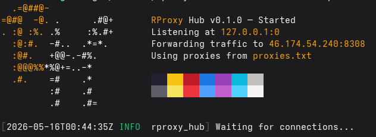

# RProxy Hub

Rust Proxy Hub

⚡️ Blazing fast traffic forwarder using proxies ⚡️

*🛠 Currently it's in developing 🛠*

# Why?
- 🔥 **Blazingly fast** — Built in pure Rust with zero garbage collection. It just flies.
- 🦀 **Guaranteed stability** — Compiler-enforced memory safety means no random segfaults or runtime crashes.
- ⚡ **Async under the hood** — Driven by Tokio to handle thousands of concurrent proxy connections with near-zero latency.
- 🎨 **Clean CLI** — Features very cool interface

# Contributing

Please read [CONTRIBUTING.md](CONTRIBUTING.md) for details on our code of conduct and the process for submitting pull requests.

# Code of Conduct

This project adheres to a [Code of Conduct](CODE_OF_CONDUCT.md). By participating, you are expected to uphold this code.

# Security

For security concerns, please refer to our [Security Policy](SECURITY.md).